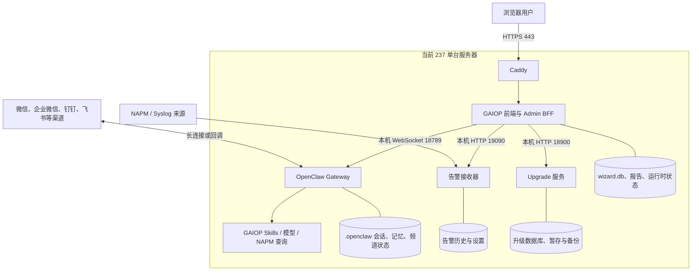
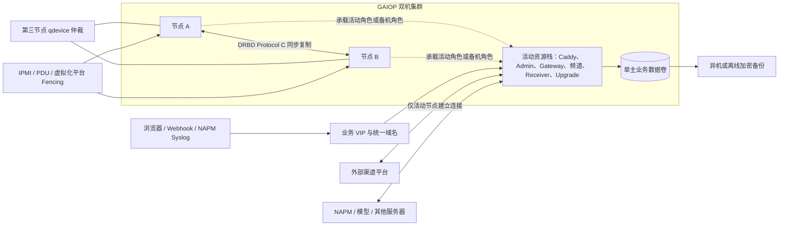
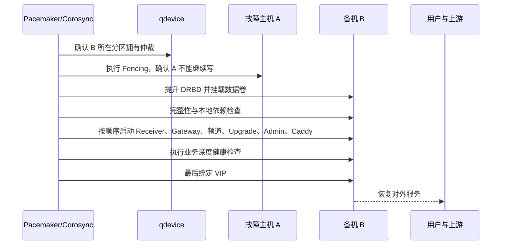

# GAIOP 双机主备灾备规划

| 属性 | 内容 |
|---|---|
| 文档日期 | 2026-08-31 |
| 文档状态 | 规划草案 v0.1，尚未实施 |
| 规划对象 | GAIOP 前端、Admin BFF、OpenClaw Gateway、频道、告警接收、报告、升级服务及其本地状态 |
| 推荐方案 | 整套 GAIOP 单主运行、另一台热备；先人工切换，再在具备仲裁和隔离条件后自动切换 |
| 当前结论 | 技术上可以做，不是 GAIOP 无法做；当前只是尚未建设双机集群能力 |
| 本轮边界 | 只做规划，不改生产网络、服务、数据、定时任务和部署 |

## 1. 先说结论

GAIOP 适合做“双机主备”，而且现阶段没有必要直接做双活。

这里说的“双机主备”是：两台服务器都装好同一套 GAIOP，平时只有一台对外工作，另一台持续准备并同步业务数据；主机故障后，把整套 GAIOP 切到备机。它属于双机灾备。

需要避免一个常见误解：

- “有两台服务器”不等于双机灾备；
- “每天把文件复制到另一台”属于备份，通常不算热备；
- “Keepalived 能把 IP 漂过去”只解决入口，不等于数据库、OpenClaw、频道和报告也安全切换；
- “主机和备机同时启动全套服务”不是本规划的目标，反而可能造成双写和重复收发消息。

本项目建议分两步建设：

1. **第一步：人工切换的热备。** 数据持续同步，备机服务保持停止；出现故障后按操作手册人工确认并切换。目标恢复时间为 10～30 分钟。
2. **第二步：自动切换的主备。** 增加集群管理、第三方仲裁和故障节点隔离，在确认原主机不能继续写入后自动启用备机。目标恢复时间为 2～5 分钟。

第一步已经能够解决大部分“单台服务器坏了，GAIOP 整体不可用”的问题，也便于先把数据和频道问题摸清。第二步不是简单加一个自动脚本，而是必须把“脑裂”风险处理完整后才能启用。

### 1.1 难度判断

| 工作 | 难度判断 | 原因 |
|---|---|---|
| 准备第二台同配置服务器、部署同版本程序 | 相对容易 | 主要是标准化安装、版本和配置校验 |
| 将入口改为 VIP/统一域名 | 相对容易 | 前提是两台在可漂移 VIP 的网络中 |
| 同步 SQLite、OpenClaw、报告等本地状态 | 中等 | 数据分散，必须先完整盘点并迁移到单主数据卷 |
| 人工主备切换 | 中等、可控 | 核心是先隔离旧主、再提升备机，并形成可重复手册 |
| 无人值守自动切换 | 较难但可解决 | 必须增加第三方仲裁、Fencing、资源顺序和误切防护 |
| 各渠道特别是个人微信无感接管 | 较难，必须实测 | 受设备登录、出口 IP、插件和平台风控影响 |
| 真正双活 | 当前不建议 | 需要数据库、文件、任务和频道机制的应用级重构 |

整体判断是：**GAIOP 做主备热备没有技术性阻断，工作量主要在部署和运维体系，以及少量应用可切换性整改；难点是避免双主，而不是把第二台机器启动起来。**

## 2. 状态口径

本文用以下四种口径，防止把规划写成现状：

| 口径 | 含义 |
|---|---|
| 已确认 | 已从当前代码、部署资料或 2026-08-31 的 237 只读核查中得到依据 |
| 当前已启用 | 237 当前正在使用的能力 |
| 尚未完成 | 当前仓库或生产环境没有这项双机能力 |
| 需要现场核查 | 实施前必须在两台目标服务器和真实网络中确认，本文不能代替现场结果 |

### 2.1 当前已确认

- 237 当前是一台服务器承载整套 GAIOP。
- 公网入口是 Caddy 的 HTTPS 443；Admin BFF 监听本机 `127.0.0.1:3000`。
- OpenClaw Gateway 使用本机端口 18789，升级服务使用本机端口 18900，告警接收器管理接口使用本机端口 19090。
- Caddy、Admin、Gateway、Upgrade 和告警接收链路目前都依赖同一台主机；本轮只读健康检查正常。
- 当前 OpenClaw 基线为 `2026.5.4`，Node.js 基线为 `22.14.0`。未来双机必须保持版本和插件完全一致。
- Admin 的用户、权限、审计、报告登记等数据在 SQLite `wizard.db` 中。
- OpenClaw 的会话、记忆、频道登录态、设备身份和运行状态主要位于 `/home/netinside/.openclaw`。
- 正式报告、报告来源、恢复区、告警历史、运行时桥接、升级状态等分布在多个目录，不是只复制一个数据库就能恢复。
- Admin 登录令牌和 SSE 连接保存在进程内存中。Admin 重启或换机后，浏览器需要重新登录并重新建立实时连接。
- 当前已经有 systemd 进程自动重启、SQLite 在线备份、报告恢复区和部分留存机制，但它们仍在同一台服务器上。

### 2.2 尚未完成

在本轮核查的 GAIOP/GAIOP-Admin 代码和部署资料中，没有发现以下已落地的双机能力：

- Keepalived 或业务虚拟 IP 的正式配置；
- Pacemaker、Corosync、仲裁节点或集群资源约束；
- STONITH/Fencing 故障节点隔离；
- DRBD 或等价的单主同步复制；
- 自动或人工主备切换脚本；
- 双机切换验收、演练和回切记录。

因此，当前是“单机运行 + 本机进程恢复 + 本机备份”，不是“双机热备已经做了一半”，也不是“代码不支持所以做不了”。

## 3. 当前架构和单点故障



当前 systemd 可以在某个进程退出后重启该进程，但以下情况仍会让整套系统停止：

| 故障 | 当前影响 | 本机重启能否解决 |
|---|---|---|
| 整机掉电、主板或系统盘损坏 | Caddy、BFF、Gateway、频道、告警和升级全部不可用 | 不能 |
| 主机网络或网卡故障 | 用户、NAPM 和外部渠道无法到达 | 不能 |
| 文件系统损坏 | SQLite、会话、报告或配置可能同时受损 | 通常不能 |
| 单个服务进程退出 | 对应能力短时中断 | 多数可以 |
| 上游 NAPM、模型或渠道平台故障 | 相应业务能力不可用 | 换到备机也不能 |
| 人为误删、错误升级、勒索或逻辑损坏 | 错误可能影响业务数据 | 同步复制会把错误同步过去，必须靠备份 |

所以双机主备主要解决“GAIOP 这台应用服务器本身坏了”的问题，不会自动解决 NAPM 故障、模型服务故障、整个机房断网或人为删除。

## 4. 为什么不建议直接双活

双活是两台服务器同时对外服务。对 GAIOP 当前形态来说，这会把问题明显放大：

1. **SQLite 不适合两台机器同时写同一份文件。** Admin、Upgrade 等状态库存在 WAL/SHM 和事务一致性要求，不能靠 NFS、rsync 或共享目录让两台服务同时写。
2. **OpenClaw 和频道是有状态的。** 两个 Gateway 同时使用同一账号和同一会话目录，可能重复消费消息、重复回复、互相挤掉登录或形成两份不同历史。
3. **定时任务和清理任务会重复执行。** 报告归因、留存、备份、任务计划和通知如果两边都运行，可能重复生成、重复发送或重复处理。
4. **升级操作不能双写。** 两台升级服务同时接受任务，会出现版本、数据库结构和回滚点不一致。
5. **当前登录和实时连接是进程态。** 即使前面加负载均衡，也没有现成的跨节点会话共享和请求粘滞设计。

这些不是永远无法解决，但要做双活就需要把 SQLite 改为外部高可用数据库、把文件改成共享对象存储、把任务和消息做分布式锁与幂等、把频道消费做主节点选举。这相当于重构平台，不符合当前“双机灾备”的投入目标。

## 5. 推荐目标架构

### 5.1 总体原则

- 两台服务器都安装同版本的 GAIOP 程序，但任何时刻只有一台运行有写入能力的业务服务。
- 程序代码分别部署到两台服务器，保持版本和文件哈希一致，不通过 DRBD 复制整个系统盘。
- 所有必须随主机切换的业务状态放入一个受控的单主数据卷，通过 DRBD Protocol C 同步复制。
- DRBD 文件系统同一时刻只允许在活动节点挂载；备机不能同时挂载和写入。
- 用户和 NAPM 使用虚拟 IP 或统一域名访问，不再固定指向某一台物理主机。
- 自动切换必须具备第三方仲裁和 Fencing；没有这两个条件时只允许人工切换。
- 自动切换后不自动切回原主机。原主机修好后先作为备机重新同步，再安排维护窗口人工回切。

### 5.2 目标拓扑



图中的第三节点只负责投票，不运行 GAIOP，也不存 GAIOP 业务数据。它可以是一台独立的小型虚拟机，但必须与两台 GAIOP 节点处于不同故障域，不能放在任一节点本机里。

### 5.3 推荐组件

| 目的 | 推荐组件 | 说明 |
|---|---|---|
| 集群状态与资源编排 | Pacemaker + Corosync | 控制哪台是主、启动顺序、失败迁移和禁止双主 |
| 两节点仲裁 | Corosync qdevice/qnetd | 在两台互相看不到时提供第三票，不承载业务 |
| 故障节点隔离 | STONITH/Fencing | 通过 IPMI、PDU 或虚拟化 API 确保旧主机真正停止 |
| 本地状态同步 | DRBD Protocol C，单主模式 | 写入在主备磁盘都落盘后再确认，适合当前单机文件与 SQLite 形态 |
| 统一入口 | Pacemaker 管理的虚拟 IP | VIP 只跟随健康的完整业务资源栈，不单独漂移 |
| 服务守护 | systemd + Pacemaker resource agent | systemd 管单进程，Pacemaker 管整套资源在哪台运行 |
| 独立备份 | 加密、带版本、异机保存 | 防误删、逻辑损坏、勒索和两节点同时损坏 |

只使用 Keepalived 的方案不作为正式自动灾备方案。它可以移动 IP，却无法可靠地决定谁可以挂载数据盘、谁能启动 Gateway，更不能强制关闭失联但仍在运行的旧主机。

## 6. 哪些内容必须随主机切换

这是 GAIOP 双机建设中最重要、也最容易漏掉的工作。只同步 `wizard.db` 不够。

### 6.1 必须进入单主复制数据卷的状态

| 数据类别 | 当前已知位置或范围 | 原因 | 实施状态 |
|---|---|---|---|
| Admin 数据库 | `/var/lib/gaiop/admin/wizard.db` | 用户、权限、审计、配置、报告登记等权威元数据 | 已确认，需纳入 |
| Admin 网关设备身份 | `/var/lib/gaiop/admin/gateway-device-identity.json` | 备机接管后要保持同一受控 Gateway 身份 | 已确认，需验证使用方式 |
| OpenClaw 状态 | `/home/netinside/.openclaw` 下的 credentials、agents、sessions、memory、workspace、media、频道状态等 | 会话、记忆、账号登录和渠道连续性的核心 | 已确认目录，子目录需逐项清点 |
| 正式报告 | `/var/lib/gaiop/reports` | 报告实体与下载入口必须和登记数据一致 | 已确认，需纳入 |
| 报告来源与运行时桥接 | `/var/lib/gaiop/runtime`，包括活动数据源和 report-provenance | BFF、Gateway 和报告侧车的共同状态 | 已确认，需纳入 |
| 报告恢复区 | `/var/lib/gaiop/report-recovery` | 处于 7 天恢复期的报告不能在切换后消失 | 已确认，需纳入 |
| 告警状态 | 告警 JSONL、设置、游标和接收器状态目录 | 历史分页、SSE 游标和通知去重需要连续 | 路径需现场核查 |
| Upgrade 状态 | Upgrade SQLite、包暂存、任务、回滚登记和组件自有备份 | 切换后要知道是否有升级正在执行及可用回滚点 | 路径与保留范围需现场核查 |
| 频道适配状态 | 个人微信适配器及其他本地插件的状态、登录材料 | 防止切换后要求重新扫码或重复消费 | 各渠道需现场验证 |

建议建立一个 DRBD 文件系统，例如挂载到 `/srv/gaiop-ha`，再用 **bind mount** 映射到现有程序要求的目录。不要用符号链接代替，因为现有报告、留存和备份安全检查会保护或拒绝符号链接。

建议的数据卷逻辑布局如下，最终名称以现场盘点为准：

```text
/srv/gaiop-ha/
├─ admin/
├─ openclaw/
├─ reports/
├─ report-recovery/
├─ runtime/
├─ alerts/
├─ upgrade/
└─ channel-state/
```

### 6.2 不建议通过 DRBD 复制的内容

| 内容 | 推荐做法 |
|---|---|
| Admin、Gateway、插件、Skills、Upgrade 程序代码 | 作为不可变发布包分别部署到两台服务器，并校验版本和 SHA-256 |
| Node.js、OpenClaw 和系统软件 | 通过统一安装基线管理，不能让两台版本漂移 |
| `/etc/gaiop` 配置和密钥 | 用受控配置管理安全分发；区分集群共享项和节点专有项 |
| Caddy 配置和 TLS 证书 | 两台一致部署；证书私钥通过安全渠道分发或统一签发，不盲目复制整个 Caddy 数据目录 |
| systemd unit、timer、Pacemaker 配置 | 通过版本化部署同步，业务 timer 仅在活动节点运行 |
| `/run`、PID、socket、临时恢复测试文件 | 属于当前节点瞬时状态，不复制 |
| SSH 主机密钥、主机名、物理 IP、Fencing 凭据 | 各节点独立保存，不能复制成同一身份 |
| 普通运行日志 | 优先发送到独立日志服务器；本地日志不作为切换必需状态 |
| 灾备备份 | 放到第三处存储，不能只放在同一个 DRBD 数据卷上 |

### 6.3 为什么 DRBD 适合当前形态

GAIOP 当前大量使用本机 SQLite、JSONL 和普通文件。DRBD 单主模式从块设备层同步，不要求立即改造所有应用，也可以让 SQLite 的数据库、WAL 和 SHM 保持在同一个文件系统中。

但必须遵守三条底线：

1. 任何时刻只允许一台节点挂载并写入该文件系统；
2. 计划切换前先停止业务写入、确认复制完成，再降级旧主和提升新主；
3. 不直接 rsync 正在写入的 SQLite 文件，也不让两台 SQLite 通过 NFS 同时打开同一数据库。

## 7. 真正的难点和解决思路

### 7.1 脑裂：双机最严重的风险

所谓脑裂，是节点 A 和节点 B 因网络中断互相看不到，但两边都认为自己应该当主机。

对 GAIOP 的后果不是简单的“页面偶尔打不开”，而可能是：

- 两份 `wizard.db` 同时写入并分叉；
- 两个 Gateway 同时连接微信或其他渠道，重复收发消息；
- 同一个告警被处理两次；
- 报告、审计和来源登记不一致；
- 两边同时执行升级或清理。

因此自动切换必须同时具备：

- **仲裁：** 第三节点判断哪一边保留集群票数；
- **Fencing：** 在备机接管前，通过带外管理或虚拟化平台确认旧主机已经关机、重启或断开业务存储。

仲裁只负责“判定谁赢”，Fencing 才负责“确保输的一方不能继续写”。缺少任意一项，都不建议无人值守自动接管。

### 7.2 数据分散：不能漏同步目录

当前状态分布在 `/var/lib/gaiop`、`/home/netinside/.openclaw`、Upgrade 和频道适配目录。任何一个遗漏，都可能出现“页面能打开，但历史会话、频道登录、报告或升级记录不见了”。

解决办法是在实施前运行一段观察期，记录每个服务实际打开和写入的文件、目录、数据库、锁和临时文件，形成正式的“可变状态清单”。没有完成清单，不进入自动切换阶段。

### 7.3 浏览器登录和实时连接会中断

Admin 登录 token、Gateway 待处理 RPC、SSE 浏览器连接和部分缓存是内存状态，无法靠磁盘同步迁移。切换后：

- 已登录浏览器可能返回 401，需要重新登录；
- SSE、WebSocket 会断开并重新建立；
- 正在显示的流式回答可能中断；
- Admin 停止过程中已经出现过 `WebSocket was closed before the connection was established`，需要补充优雅停机和可重复重连验证。

第一阶段可接受“切换后重新登录”，这不会阻塞双机热备。后续如果要求用户无感切换，再单独设计持久化会话或短时重认证，不能为了无感而让两台 BFF 同时运行。

### 7.4 OpenClaw 与各渠道重连

频道通常保持长连接或设备登录态，不能假设复制目录后一定无感接管：

- 原主机必须先被确认停止，备机才可启动频道连接；
- 两台机器的出口 IP 如不同，需要加入渠道平台白名单，或统一经过同一 NAT 出口；
- Webhook 回调必须使用 VIP/统一域名，不能指向物理 IP；
- 企业微信、钉钉、飞书需要验证 token、回调签名、去重和断线重连；
- 个人微信需要重点验证扫码状态、设备绑定、插件依赖、登录态是否随复制卷恢复，以及异机登录是否触发风控。

个人微信是当前最大的现场不确定项之一。正式上线前必须至少做一次“A 机登录并收发消息 -> 停止 A -> B 机接管并收发消息 -> A 保持停止”的真实演练。

### 7.5 Syslog 告警可能丢失或重复

NAPM 如果把 Syslog 固定发给主机物理 IP，切换后备机收不到，所以目标地址必须改为 VIP 或独立高可用接收地址。

如果当前使用 UDP Syslog，故障发生到 VIP 漂移之间的报文没有重传保证，不能承诺告警 RPO 为 0。可选改进顺序为：

1. 先接受切换窗口内少量 UDP 丢失，并把它写入验收结论；
2. NAPM 支持时改用 TCP Syslog；
3. 对告警零丢失要求较高时，在 GAIOP 双机前增加带磁盘队列的独立 rsyslog/RELP 接收层。

接收器和通知侧还要用稳定事件 ID 做幂等，避免上游重发后重复通知。

### 7.6 正在运行的任务不能迁移

模型请求、报告生成、数据包分析、频道回复和升级任务在内存中执行时，主机突然掉电后不能从原指令位置继续运行。

第一阶段建议：

- 切换后把中断任务标记为失败或状态待核查，不直接宣称成功；
- 对可以安全重试的任务提供人工重试；
- 报告采用临时文件写完后原子改名，接管后保护半成品和未知文件；
- 通知和频道回复使用业务事件 ID 去重；
- 升级过程中默认禁止自动切换，或切换后进入“升级状态待人工确认”，不在备机自动继续写盘。

### 7.7 自动健康检查不能只看一个端口

仅检查 443 返回 200，可能得到“前端能打开，但 Gateway 已断开”的假健康。反过来，NAPM 或模型平台暂时不可达，也不应让 GAIOP 两台机器来回切换。

建议把健康检查拆成两层：

- **决定是否切机的本地硬健康：** 主机存活、磁盘和文件系统、DRBD 状态、Caddy/Admin/Gateway/Receiver 进程、本地端口和 SQLite 完整性；
- **只告警、不自动切机的外部依赖健康：** NAPM、模型供应商、微信/企业微信/钉钉/飞书平台。

### 7.8 DRBD 不是备份

同步复制会把正确写入同步到备机，也会把误删、错误升级、数据库逻辑损坏和勒索加密同步到备机。因此必须保留：

- Admin 和 Upgrade 的 SQLite 在线一致性备份；
- 报告及其登记、来源、交付审计的成组备份；
- OpenClaw 会话、记忆、频道配置和媒体的受控备份；
- 异机、加密、版本化保存；
- 定期在隔离环境做恢复验证。

## 8. 分阶段实施规划

### 8.1 阶段 0：现场盘点和可切换性整改

**目标：** 先把“到底要切什么、能不能安全停、切过去如何证明可用”弄清楚。

主要工作：

1. 确认两台目标服务器的 CPU、内存、磁盘、网卡、系统版本、Node.js、OpenClaw、插件和 Skills 版本。
2. 记录 237 当前全部 GAIOP systemd service/timer、启动用户、依赖、环境文件、端口、读写目录和实际 unit 名称。
3. 观察并确认 Admin、Gateway、Receiver、Upgrade、报告侧车、个人微信和其他频道的全部可变状态。
4. 明确哪些 timer 当前启用；未来所有备份、留存、清理、归因和计划任务只允许活动节点执行。
5. 设计统一数据卷和 bind mount，验证现有 systemd `ReadWritePaths`、`ProtectHome`、目录所有者和权限。
6. 给每个服务补充明确的 readiness、graceful stop 和超时策略，修复 Gateway 连接在 Admin 停止时的异常噪声。
7. 确认 VIP 是否能在同一二层网络漂移；如果两台不在同一子网，改用上层负载均衡、路由/BGP 或受控 DNS，不直接套用本规划的 VIP。
8. 确认独立 qdevice、IPMI/PDU/虚拟化 Fencing 接口，以及集群节点到它们的网络可达性。
9. 先做一次当前生产备份的隔离恢复，证明现有备份真正可用。
10. 测量生产实际写入速率、磁盘 I/O、复制链路时延和初次/断线后重同步时间，确认 Protocol C 不会把业务写入拖慢到不可接受。
11. 由业务方确认 RTO、RPO，以及“切换后重新登录”和“UDP 告警可能丢少量数据”是否可接受。

阶段 0 出口条件：

- 可变状态清单完整并经过各组件负责人确认；
- 两台节点的版本和运行用户一致；
- 数据卷迁移、停机窗口和回滚方法明确；
- qdevice 与 Fencing 方案有实际设备或接口，不只停留在文档；
- 备份恢复演练通过。

预计工作量：1～2 周。此时间是规划估算，以现场资产和状态目录盘点结果为准。

### 8.2 阶段 1：人工切换热备

**目标：** 先获得可靠的双机恢复能力，不急于无人值守自动切换。

建议建设内容：

- 节点 A、B 分别安装同版本、同哈希的 GAIOP 程序包；
- 建立独立复制网络和 DRBD Protocol C 单主数据卷；
- 平时 A 挂载数据卷并运行全套服务，B 不挂载文件系统且业务服务停止；
- 配置 VIP，但由人工切换流程控制；或在首轮演练中先人工更新入口；
- 建立只读监控，持续观察 DRBD 同步、磁盘、服务和备份状态；
- 编写计划切换、故障接管、放弃接管、回退和旧主机重新加入的操作手册；
- 完成至少 3 次连续演练，且每次都有时间线和数据核对记录。

建议目标：

| 指标 | 阶段 1 目标 |
|---|---|
| RTO | 10～30 分钟 |
| 本地持久数据 RPO | DRBD 正常且两端 UpToDate 时接近 0；统一对外承诺建议先写为不超过 1 分钟 |
| UDP 告警 RPO | 不承诺 0，以实测切换窗口为准 |
| Web 登录 | 允许重新登录 |
| 流式回答和运行任务 | 允许中断，必须可识别为失败或待核查 |
| 自动切回 | 禁止 |

人工故障接管顺序：

1. 宣布故障并停止升级、清理、备份和其他写任务；
2. 通过带外管理、物理断电或网络隔离，证明旧主机不可能继续写入；
3. 核对两端 DRBD 状态，确认哪一端是权威数据；状态不明确时停止接管，不强制双主；
4. 在备机提升 DRBD 主角色并挂载业务数据卷；
5. 检查文件系统、目录所有者、关键文件和 SQLite `PRAGMA integrity_check`；
6. 按依赖顺序启动 Receiver、Gateway、频道插件、个人微信适配器、Upgrade、Admin、报告侧车和 Caddy；
7. 验证本机深度健康，不只检查首页；
8. 最后绑定 VIP 或切换统一入口；
9. 验证登录、WebChat、历史会话、报告、告警、各渠道收发和审计；
10. 记录实际 RTO、可能丢失或重复的数据及后续处置。

计划切换应先停止入口和业务写入，等待 DRBD 完全同步，再停止旧主资源。故障接管则必须先隔离旧主，不能因为追求几分钟恢复而跳过这一条。

### 8.3 阶段 2：自动主备切换

**目标：** 在阶段 1 已经稳定、可重复人工切换后，让集群自动完成节点故障接管。

建设内容：

- Pacemaker/Corosync 两节点集群；
- 独立 qdevice/qnetd 第三票；
- 两台节点均可实际执行和验证的 STONITH/Fencing；
- DRBD promoted/unpromoted、Filesystem、服务组、Caddy 和 VIP 资源；
- 严格的 colocate 和 order 约束；
- 失败计数、迁移阈值、超时、维护模式和手工冻结机制；
- 集群事件、Fencing、DRBD 降级、备份失败和业务深度健康监控；
- 禁止自动 failback，避免修好的旧主机一上线又引发第二次业务中断。

自动接管顺序：



建议目标：

| 指标 | 阶段 2 目标 |
|---|---|
| RTO | 2～5 分钟，最终以真实断电演练为准 |
| 本地持久数据 RPO | 正常同步链路下不超过 1 分钟，不能笼统承诺所有业务为 0 |
| 同时活动节点数 | 始终为 1 |
| 自动接管前置条件 | 仲裁有效、Fencing 成功、备机数据状态可确认 |
| 不满足前置条件 | 保持停止或人工介入，不能冒险双主 |

### 8.4 阶段 3：持续优化

- 将外部渠道、个人微信、告警、任务和报告的故障状态做成可追踪、可重试、可去重的业务状态；
- 建立异机备份、季度恢复演练和备份不可变策略；
- 根据真实 UDP 告警损失决定是否增加独立日志接收队列；
- 评估是否需要跨机房灾备。跨机房高延迟下不一定适合 DRBD Protocol C，应另行设计异步复制和人工接管；
- 只有业务确实需要两台同时承载流量时，再评估数据库、文件、队列和频道的应用级高可用改造。

## 9. 集群资源和启停建议

建议把整套 GAIOP 视为一个不可拆散的资源栈，而不是让各服务独立漂移到不同节点。

推荐启动关系：

```text
Fencing 与仲裁可用
  -> DRBD 提升为主
  -> 挂载单主数据卷和全部 bind mount
  -> 文件系统、权限、数据库检查
  -> 告警 Receiver
  -> OpenClaw Gateway
  -> 各频道插件与个人微信 Adapter
  -> Upgrade 服务
  -> Admin BFF / 前端
  -> 报告归因等侧车
  -> Caddy
  -> 业务深度健康检查
  -> VIP 最后对外
```

停止顺序反向执行：先撤 VIP，阻止新请求进入；再停止 Caddy、Admin、侧车、Upgrade、频道、Gateway 和 Receiver；最后卸载数据卷并降级 DRBD。

需要注意：如果 Caddy 配置为只绑定 VIP，VIP 放到最后会导致 Caddy 无法预启动。实施时应让 Caddy 监听本机通配地址或回环健康地址，由防火墙和 VIP 决定是否对外。

所有写数据的 timer 都必须满足“只在活动节点执行”：

- SQLite 备份；
- Admin/Upgrade 留存与清理；
- 正式报告留存；
- 报告归因和修复侧车；
- 会话留存；
- 任务计划和频道通知；
- 系统升级相关后台任务。

不建议仅在两台机器上都 `enable` timer 再依赖脚本自觉判断。应由 Pacemaker 管理 timer，或在每个任务入口增加可验证的活动角色锁，两者至少有一项，关键清理任务最好两项都有。

## 10. 发布、升级和回切策略

双机上线后，每次发布不能只更新当前主机。

建议流程：

1. 集群进入维护窗口，暂停自动迁移和所有清理/升级 timer；
2. 确认备份和 DRBD 正常，创建可验证的应用与 SQLite 回滚点；
3. 先更新当前备机的不可变程序包，验证版本、依赖和哈希；
4. 进行一次计划切换，使新版本节点成为主机；
5. 验证 Web、Gateway、报告、告警和渠道；
6. 再更新原主机，使其以相同版本重新加入为备机；
7. 恢复集群监控和允许的 timer；
8. 记录两台版本、数据库版本、切换时间和回滚点。

如果新版本包含不可逆数据库迁移，不能把“切回旧程序”当成完整回滚。升级设计必须明确数据库前后兼容窗口、备份恢复方法和回滚时的数据损失边界。

旧主机故障恢复后：

- 不允许自动夺回 VIP；
- 先清除故障原因，确认没有旧的独立写入；
- 必要时丢弃旧节点过期副本，从当前主机做全量重新同步；
- 同步完成并通过检查后只作为备机加入；
- 是否回切由维护窗口人工决定。

## 11. 验收与演练矩阵

| 场景 | 预期结果 | 必须保留的证据 |
|---|---|---|
| 单个 Admin 进程退出 | systemd/Pacemaker 本机恢复，不立即切整机 | 进程退出、重启和健康时间线 |
| Gateway 进程退出 | 本机重启并恢复 BFF 连接；频道重连无重复回复 | Gateway、Admin、频道日志与测试消息 |
| 主机 A 直接断电 | A 被确认隔离，B 单主接管，VIP 恢复 | Fencing、仲裁、DRBD、资源迁移和 RTO |
| A-B 复制网络中断 | 不出现双主；没有仲裁/Fencing 时不自动接管 | 两端角色、仲裁票和写入验证 |
| qdevice 单独故障 | 当前主机继续服务并告警，不盲目切换 | 集群状态和告警 |
| A 故障且 qdevice 不可用 | 按既定安全策略停止自动接管或人工确认 | 阻断原因和人工审批 |
| 计划 A -> B 切换 | 写入先停、数据同步完成、服务顺序正确 | 切换清单、RTO、前后哈希与数据数量 |
| 旧 A 恢复上线 | 不自动回切、不出现第二个 Gateway | 资源角色和 VIP 唯一性 |
| SQLite 写入中主机断电 | B 上 integrity_check 通过，业务数据可读写 | 每个 SQLite 的完整性结果 |
| 报告生成中断 | 完成报告保持一致，半成品受保护且不误登记 | 文件、登记、来源和审计核对 |
| WebChat 流式输出中断 | 用户看到中断，重连后不会把错误状态显示为成功 | 浏览器、SSE 和会话历史核对 |
| 企业微信/钉钉/飞书切换 | 单一连接恢复，测试消息只收发一次 | 平台回调、事件 ID 和消息记录 |
| 个人微信切换 | 登录态结论明确，无双登录和重复回复 | 扫码/登录、插件、收发消息记录 |
| UDP Syslog 连续发送时切换 | 丢失和重复数量被实测、可解释 | 发送计数、接收计数、事件 ID |
| Upgrade 执行中故障 | 不自动继续未知任务，状态进入人工核查 | 升级数据库、包、日志和回滚点 |
| 两节点误删同一业务文件 | 从第三处备份恢复，而不是从 DRBD 找回 | 备份清单和隔离恢复结果 |
| 主备版本故意不一致 | 集群阻止不兼容节点接管并告警 | 版本门禁和阻断记录 |

正式自动切换上线的最低验收条件：

- 连续 3 次计划切换和 3 次真实断电接管成功；
- 每次都能证明任何时刻只有一个活动 Gateway 和一个可写数据卷；
- 所有 SQLite 完整性检查通过，报告和会话抽样一致；
- Web、告警和已启用渠道均有真实收发验证；
- RTO 达标，RPO 损失有计数而不是口头判断；
- Fencing 真实执行过，不接受只测试命令语法；
- 备份在双机之外，并完成一次隔离恢复；
- 运维人员能够在无开发人员临场指导下按手册完成切换和停止接管。

## 12. 监控和日常运维

至少监控以下项目，并将告警发送到不依赖 GAIOP 双机本身的外部通道：

- 两节点在线和 Corosync 环状态；
- qdevice 投票和 Fencing 可用性；
- 当前活动节点、VIP 所在节点和资源失败计数；
- DRBD 角色、连接状态、同步比例、磁盘状态和复制延迟；
- 文件系统容量、inode、只读挂载和 I/O 错误；
- Admin、Gateway、Receiver、Upgrade、Caddy 和频道进程；
- Gateway 到 Admin 的连接、频道重连次数和消息积压；
- SQLite 备份、异机备份和最近一次恢复验证；
- 两台代码、OpenClaw、Node.js、插件和配置哈希漂移；
- 定时任务是否只在活动节点执行。

建议运维节奏：

| 周期 | 工作 |
|---|---|
| 每日 | 检查集群、DRBD、容量、服务和备份告警 |
| 每周 | 核对主备版本/配置哈希、Fencing 可达性和频道重连异常 |
| 每月 | 做一次计划切换或最小业务切换验证 |
| 每季度 | 做一次主机断电演练和异机备份恢复演练 |
| 每次发布后 | 验证两节点版本一致，并重新执行核心业务冒烟 |

## 13. 风险清单

| 风险 | 影响 | 建议控制 |
|---|---|---|
| 没有第三仲裁和 Fencing 就自动切换 | 形成双主并破坏数据库、频道和报告 | 只能人工切换；条件齐全后才启用自动接管 |
| 可变状态清单遗漏 | 切换后部分数据或登录态丢失 | 阶段 0 观察实际写路径，各组件负责人签字确认 |
| 两节点处于同一电源、交换机或宿主机 | 单一故障同时击穿主备 | 分离电源、宿主机和网络故障域 |
| 两台虚拟机位于同一宿主机或无高可用保障的同一存储 | 宿主机或存储故障时主备同时消失 | 分散宿主机，并确认底层存储故障域；不能只看虚拟机数量 |
| DRBD 同步链路时延或带宽不足 | 写入变慢，断线重同步时间过长 | 使用独立低延迟链路，按真实写入和重同步场景压测 |
| 主备版本或插件漂移 | 备机启动失败或数据格式不兼容 | 不可变发布、哈希门禁、备机先验证 |
| 个人微信异机登录限制 | 接管后无法恢复或触发风控 | 真实演练，准备重新扫码和人工降级流程 |
| UDP Syslog 切换丢包 | 告警历史缺口 | 实测并接受边界，或改 TCP/增加磁盘队列接收层 |
| 误把外部依赖故障当成本机故障 | 两台之间来回切换但业务仍不可用 | 外部健康只告警，不作为自动迁移条件 |
| DRBD 把误删和损坏同步过去 | 两份数据同时损坏 | 第三处版本化、加密、可恢复备份 |
| 自动回切 | 旧主恢复时再次造成中断或双主 | 永不自动 failback，人工重新加入 |
| 运维复杂度上升 | 错误操作可能比单机故障更危险 | 先人工热备，持续演练，再开放自动化 |

## 14. 需要业务和现场确认的决策

以下问题不影响先做规划，但在采购和实施前必须确定：

| 决策 | 建议默认值 |
|---|---|
| 双机保护范围 | 整套 GAIOP，不只保护前端或 BFF |
| 第一期恢复方式 | 人工热备切换 |
| 最终恢复方式 | 有 qdevice 和 Fencing 后自动接管，禁止自动回切 |
| RTO | 第一期 10～30 分钟；第二期 2～5 分钟 |
| RPO | 本地持久数据按不超过 1 分钟设计；UDP 和在途任务单独说明 |
| 浏览器体验 | 第一期接受重新登录和流式请求中断 |
| 节点位置 | 优先同园区、同低延迟网络但分宿主机/电源；跨机房另行设计 |
| 统一入口 | 同子网使用 VIP；不同子网使用负载均衡或路由方案 |
| 仲裁节点 | 独立小型虚拟机，位于第三故障域 |
| Fencing | 优先虚拟化 API；物理机使用 IPMI 或可控 PDU |
| 数据复制 | DRBD Protocol C 单主，不采用双写 NFS/rsync |
| 异机备份 | 必须建设，不能以备机代替备份 |
| 个人微信 | 上线前必须做真实异机接管演练 |

还需现场补齐的信息：

- 第二台服务器是否已经存在，配置是否能独立承载全部峰值负载；
- 两台是物理机还是虚拟机，是否具备可调用的带外断电接口；
- 是否有第三台轻量服务器放 qdevice；
- 两台是否在同一二层网络，能否申请业务 VIP；
- 复制链路的带宽、时延和冗余路径；
- NAPM Syslog 当前使用 UDP 还是 TCP，目标能否改为 VIP；
- 各渠道是否限制出口 IP、设备或并发登录；
- Upgrade、告警和个人微信实际状态目录；
- 当前所有 systemd unit/timer 的正式名称、启用状态和启动关系；
- 业务可以接受的维护窗口和最大数据损失。

## 15. 推荐的下一步

这份规划通过后，不建议立刻安装 Pacemaker。下一步应先执行“阶段 0 只读盘点”，产出四份可以直接用于实施的清单：

1. **服务清单：** 每个服务的版本、用户、端口、依赖、健康检查、启停时间和 timer；
2. **数据清单：** 每个写目录、数据库、文件类型、所有者、一致性和备份方式；
3. **基础设施清单：** 两台节点、三类网络、VIP、qdevice 和 Fencing 接口；
4. **切换验收清单：** Web、会话、报告、告警、各渠道、升级和备份的具体测试用例。

清单完成后再把本规划升级为 v0.2，确定最终路径、IP、资源名、RTO/RPO、Pacemaker 约束和完整切换命令。这样做不是因为 GAIOP 不能双机，而是为了避免在状态目录和故障隔离尚未确认时，把“自动切换”变成“双机同时写入”。

## 16. 本规划不授权的操作

本文不授权以下动作：

- 修改 237 网络、IP、Caddy、systemd 或防火墙；
- 安装或启动 DRBD、Pacemaker、Corosync、qdevice、Keepalived；
- 复制、迁移、删除或恢复生产数据库和业务文件；
- 启停 GAIOP 服务、timer 或频道；
- 执行主备切换、Fencing、生产备份或升级；
- 提交、推送或发布任何生产变更。

所有实施动作都应在目标资产、停机窗口、备份、回滚和审批明确后另行执行。
